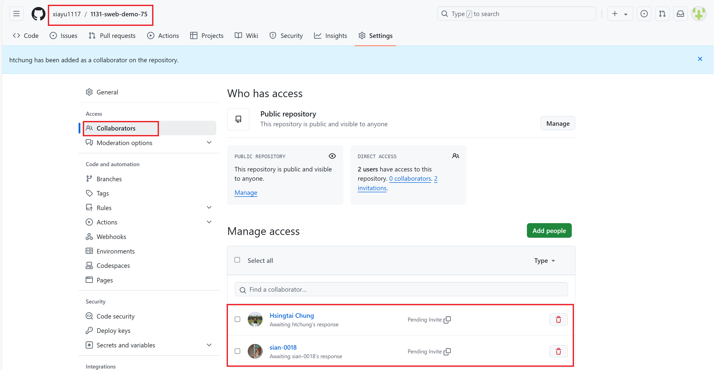
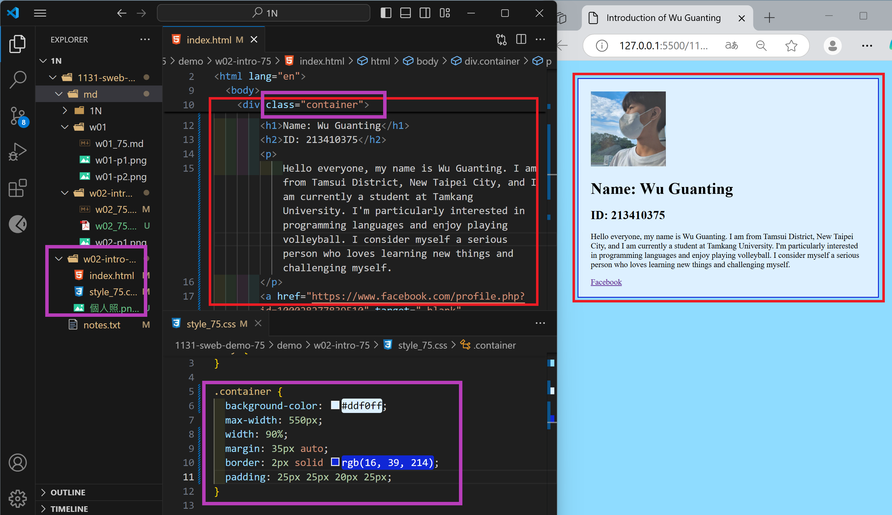

### w02-p1: Collaborate your Github repo to htchung@gms.tku.edu.tw and sian-0018(TA)



```
d6239d1 xiayu   Fri Sep 20 01:08:55 2024 +0800  w02-p1: Collaborate your Github repo to htchung@gms.tku.edu.tw and sian-0018(TA)
```

### W02-P2: MY Introduction using html with css selector (container)



```
ae25073 xiayu   Wed Sep 25 18:53:56 2024 +0800  W02-P2: MY Introduction using tag  <a> <h1> <h2> <p> with css selector (container)
```

### w02-p3: git logs of w2

```
ae25073 xiayu   Wed Sep 25 18:53:56 2024 +0800  W02-P2: MY Introduction using tag , <a>, <h1>, <h2>, <p> with css selector (container)
d6239d1 xiayu   Fri Sep 20 01:08:55 2024 +0800  w02-p1: Collaborate your Github repo to htchung@gms.tku.edu.tw and sian-0018(TA)
0702689 xiayu   Thu Sep 19 23:42:40 2024 +0800  modify demo files
e08490d xiayu   Thu Sep 19 20:55:58 2024 +0800  modify demo/md/w01 files
d5421ac xiayu   Thu Sep 19 20:47:15 2024 +0800  modify md/w01 files
6c03298 xiayu   Thu Sep 19 20:42:27 2024 +0800  modify md/w01 files
a13cfae xiayu   Thu Sep 19 20:23:28 2024 +0800  w01-p1: Github URL
ea30071 xiayu1117       Thu Sep 19 20:15:31 2024 +0800  w01-p1: Github URL
```