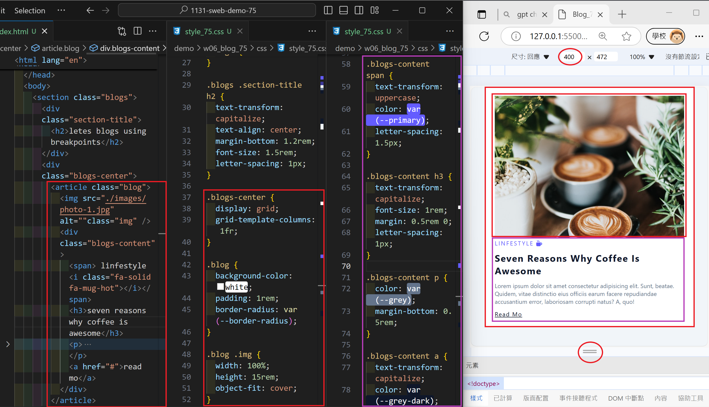
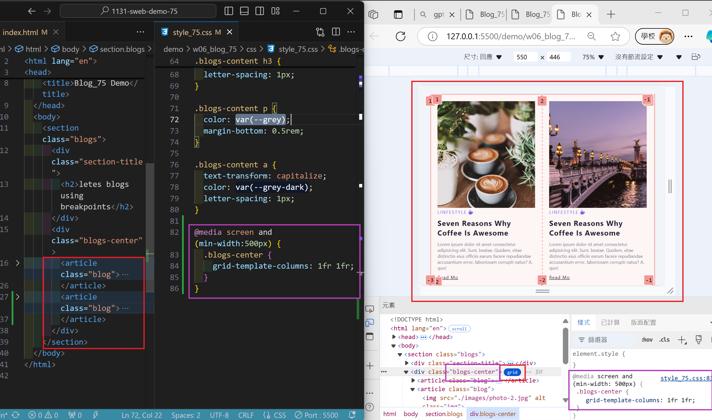
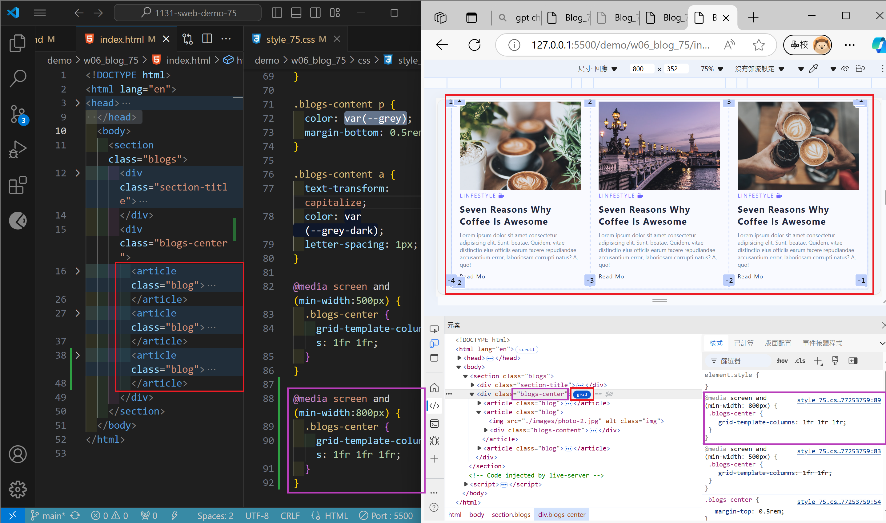
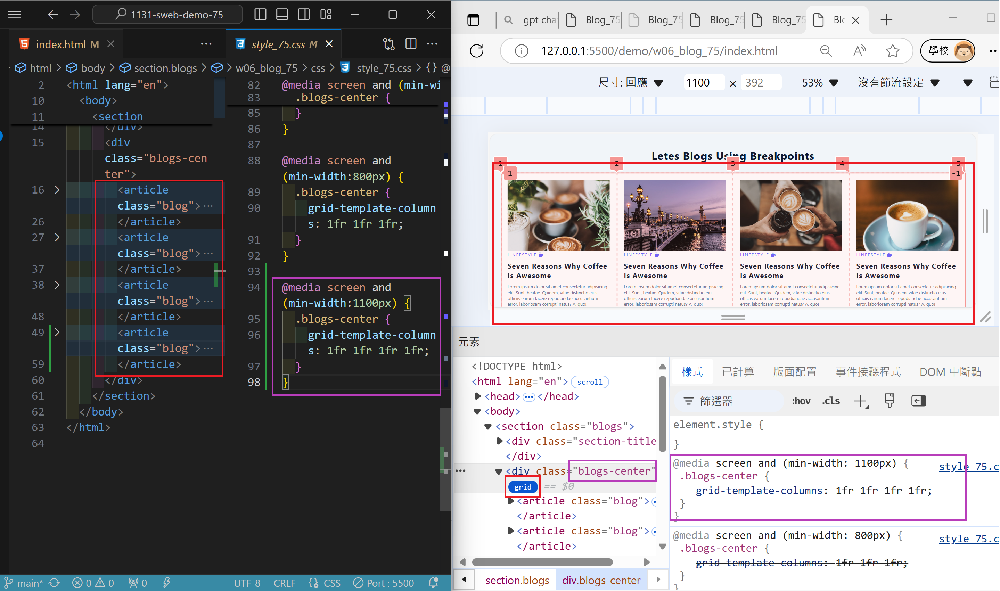
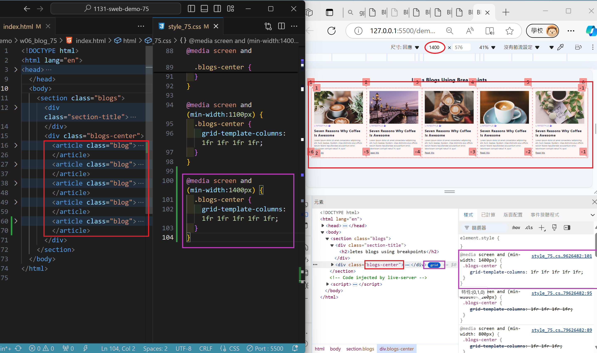
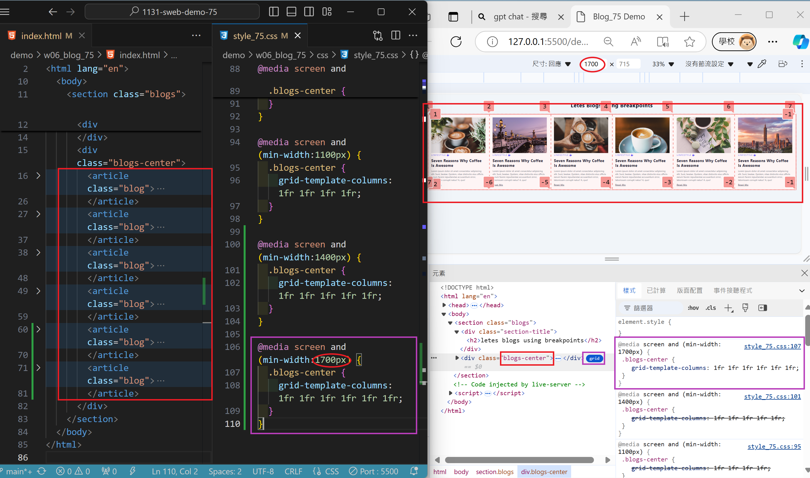
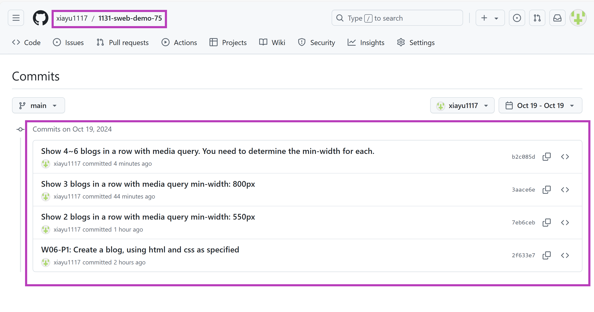

[My Github URL](https://github.com/xiayu1117/113-sweb-demo-75)

### w06-p1: W06-P1: Create a blog, using html and css as specified



```
2f633e7 xiayu   Sat Oct 19 01:49:28 2024 +0800  W06-P1: Create a blog, using html and css as specified
```

### W06-P2: Show 2 blogs in a row with media query min-width: 550px



```
7eb6ceb xiayu   Sat Oct 19 02:31:45 2024 +0800  Show 2 blogs in a row with media query min-width: 550px
```

### W06-P3: Show 3 blogs in a row with media query min-width: 800px



```
3aace6e xiayu   Sat Oct 19 03:03:10 2024 +0800  Show 3 blogs in a row with media query min-width: 800px
```

### W06-P4: Show 4~6 blogs in a row with media query. You need to determine the min-width for each.
 
#### => 4 blogs in a row
 

 
#### => 5 blogs in a row
 

 
#### => 6 blogs in a row
 

 
```
 
```

### W06-P3: git logs of W6
 
