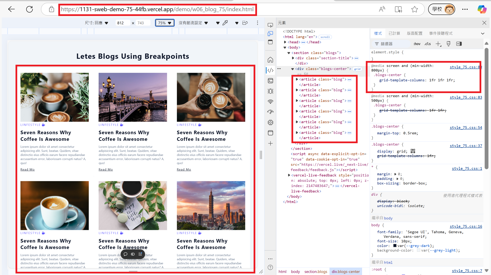
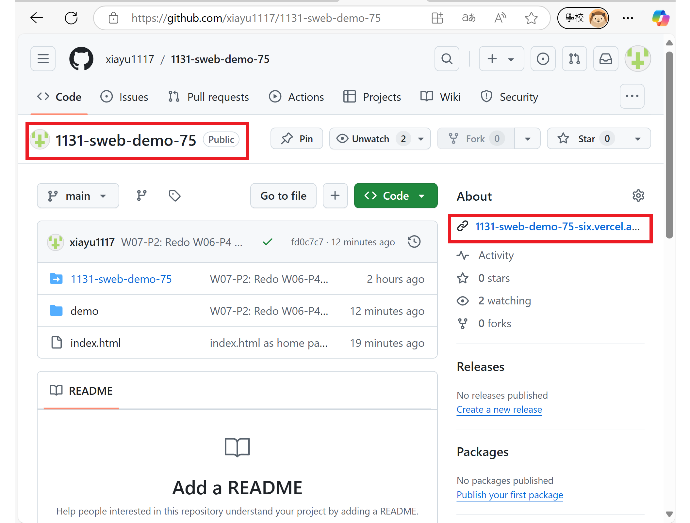
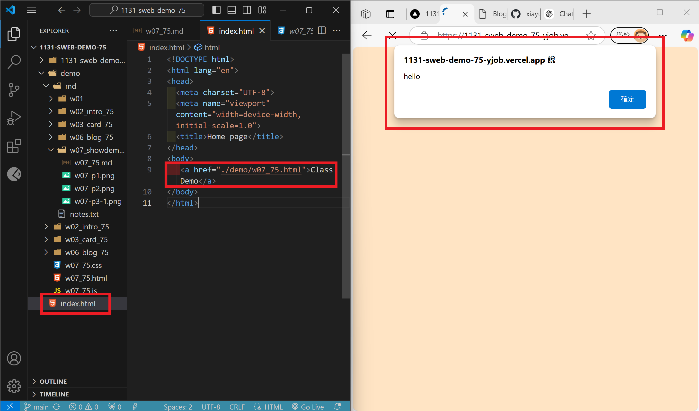

[My Github URL](https://github.com/xiayu1117/113-sweb-demo-75)

### W07-P1: Test css and js for w07_xx.html


```

```

### W07-P2: Redo W06-P4 with breakpoints being cancelled


```
1c978c8 xiayu  Sun Oct 27 22:31:26 2024 +0800  W07-P2: Redo W06-P4 with breakpoints being cancelled
```

### W07-P3: Connect your Github repo to Vercel and have a root home page to class demo navigation
 
#### => In Vercel, show w06 blogs demo
 

 
#### => Show your Github repo with Vercel URL
 
[My Vercel URL](https://1131-sweb-demo-75.vercel.app/)
 

 
#### => create index.html as root home page and have a link to class demo navigation as done in w07
 

 
```

```
